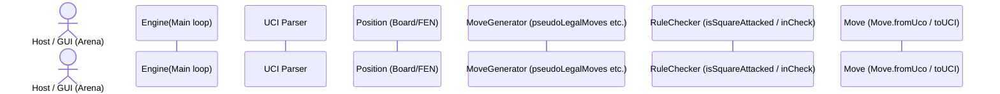

```mermaid
sequenceDiagram
    autonumber
    actor Host as Host / GUI (Arena)
    participant Engine as Engine(Main loop)
    participant Parser as UCI Parser
    participant Position as Position (Board/FEN) 
    participant MoveGen as MoveGenerator (pseudoLegalMoves etc.)
    participant Rule as RuleChecker (isSquareAttacked / inCheck)
    participant MoveObj as Move (Move.fromUco / toUCI)

``` 
